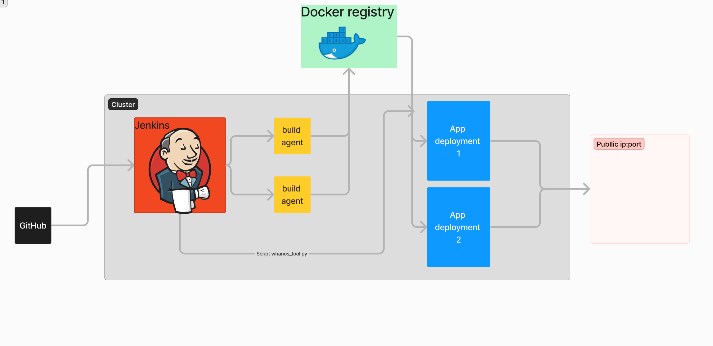

# Project Whanos EPITECH

Welcome to the Whanos project! This project aims to create a DevOps solution to run build and deploy by just adding your git repository URL.



# Table of Contents

- [Technologies](#technologies)
- [Prerequisites]('#Prerequisites')
- [Installation](#Installation)
  - [Project Structure](./structures.md)
  - [How to add a repository](./add_repository.md)
  - [Add a deployment language](./add_language.md)
- [Contributing](#contributing)
- [License](#license)

---

# Technologies

The developed solution uses the following technologies:

- [Docker](https://www.docker.com/): Containerization platform.
- [Jenkins](https://www.jenkins.io/): Automation server.
- [Helm](https://helm.sh/): Kubernetes package manager.
- [Kubernetes](https://kubernetes.io/): Container orchestration platform.
- [Terraform](https://www.terraform.io/): Infrastructure as Code (IaC) tool.
- [Python](https://www.python.org/): General-purpose scripting programming language.


# Prerequisites

Before getting started, ensure you have the following dependencies installed:

- **Justfile**: For task automation.
- **Docker**: Containerization platform.
- **Kubectl**: Kubernetes command-line tool.
- **Python**: Programming language (required for scripts and ansible).

### Optional Dependencies

These are optional dependencies, useful for local development:

- **minikube**: Lightweight Kubernetes implementation for local development.
- **k3s**: Lightweight Kubernetes distribution. Can be used for local testing and development.


# Installation

To launch the project, follow these steps:

1. ### Clone the repository:
   ```bash
   git clone git@github.com:EpitechPromo2026/B-DOP-500-BDX-5-1-whanos-alexandre.decobert.git whanos
   ```

2. ### Navigate to the project directory:
   ```bash
   cd whanos
   ```
2. ### Create a `.env` at the root folwing the [.env.exemple](../.env-exemple) pattern:
3. ### Set ur kubectl context to your k8s cluster providers
4. ### Start the project:
    - ```bash
      just start
      ```
    -  From the output get the jenkins URL
    - Go to the url and login with you password

6. ### You are all set up to using the whanos CI/CD tool
---
### Usage check the [justfile](../justfile) and [tests/justfile](../tests/justfile) recipes
___
- ## [Project Structure](./structures.md)
- ## [How to add a repository](./add_repository.md)
- ## [Add a deployment language](./add_language.md)

___
## Contributing

If you'd like to contribute to this project, feel free to open an issue to discuss the changes you'd like to make. We are open to suggestions and contributions.

## Authors

- Raphael, Alexandre, Leopold

## License

This project is distributed under the [MIT License](../LICENSE). See the `LICENSE` file for more information.

---

Feel free to check the additional documentation in the `docs/` folder for more information about the project and its operation. Thank you for contributing to the PerceptionAI project!
