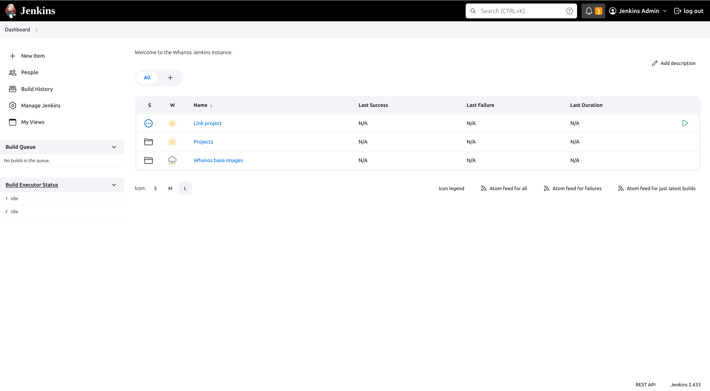
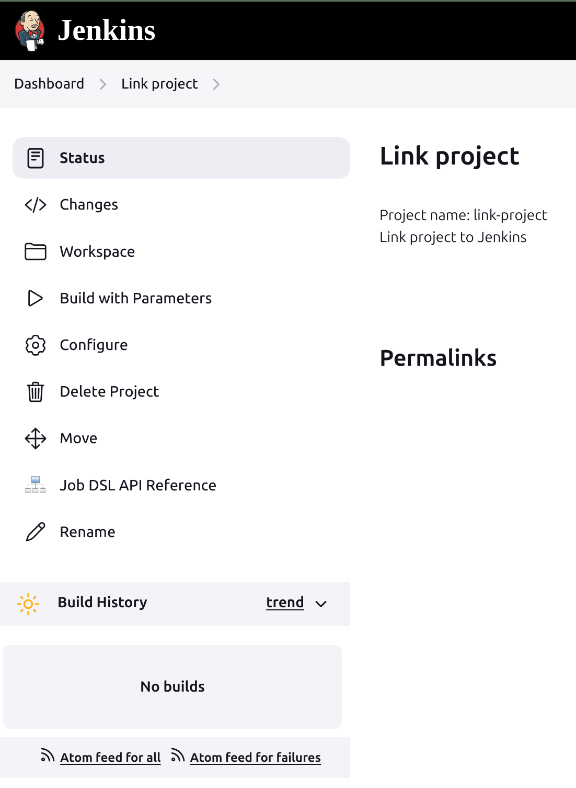
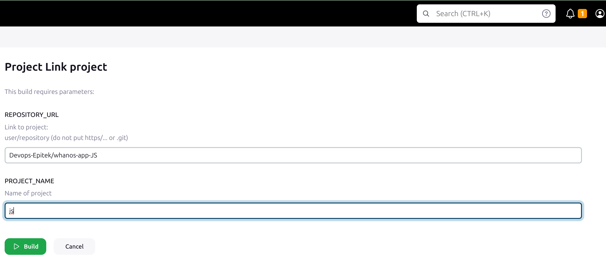

# Add a repository / link a project

# 1. From the interface go to `Link project` tab

# 2. Go to `Build with parameters` tab

# 3. Now fill the  `Repository_URL` and `Project_NAME`

(Repository_URL is `user/project` and Project_NAME a folder name so no special character)
