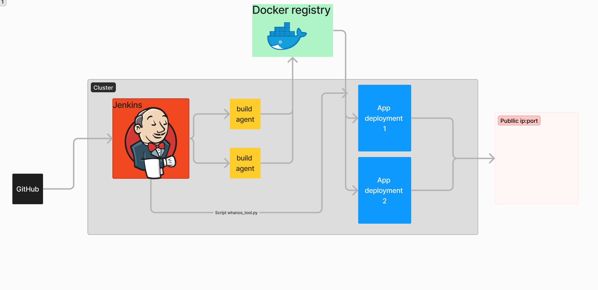

## Project Structure

The project is organized as follows:

- `docs/`: documentation about the project.
- `helm/`: Contains k8s charts helm files.
- `terraform/`: Contains tf files charts to deploy everything at once.
- `images/`: All docker container base and standalone version for each available language.
- `jenkins/`: Jenkins config file and groovy jobs.
- `scripts/`: Scripts to detect current used language and other usefully scripts.

### Helm directory
- A folder named `charts` that contains any dependent charts.
- A folder named `templates` that contains the Kubernetes manifests that will be generated.
- A file named `Chart.yaml` that contains the metadata of the chart: name, description, type, and version of the chart.
- A file named `values.yaml` that contains the values used to construct the final Kubernetes manifests from the templates.
- A file named `.helmignore` that specifies which files or directories to ignore during the artifact construction. This package will be sent to your Helm repository.

### Jenkins directory
- jenkins files

### Scripts directory
- Python scripts `detect_language.py` to detect given repository language

### Images directory
- Containing subdirectories with Dockerfile for supported programming environment.
  - Subdirectory `befunge`
  - Subdirectory `c`
  - Subdirectory `java`
  - Subdirectory `javascript`
  - Subdirectory `python`

### Tests directory
- jenkins files

### Usefull links
https://devopscube.com/kubectl-set-context/
https://devopscube.com/kubernetes-architecture-explained/
